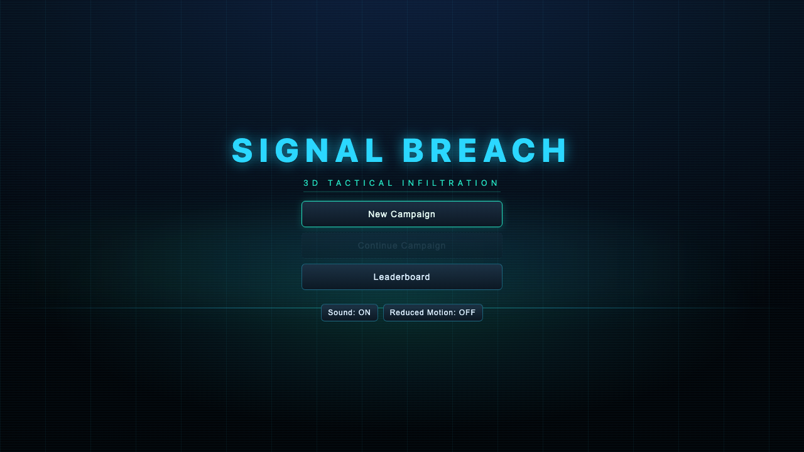
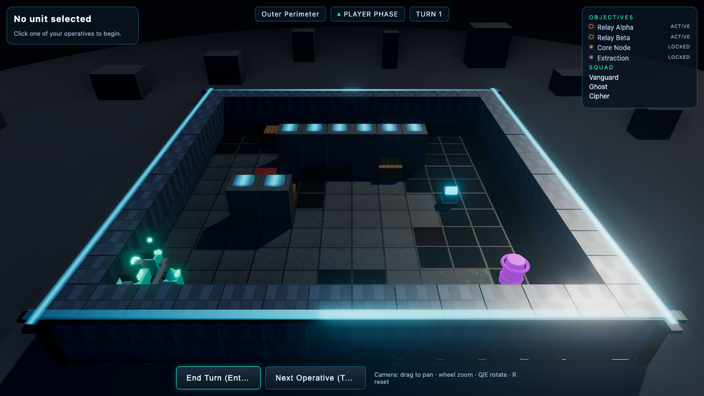
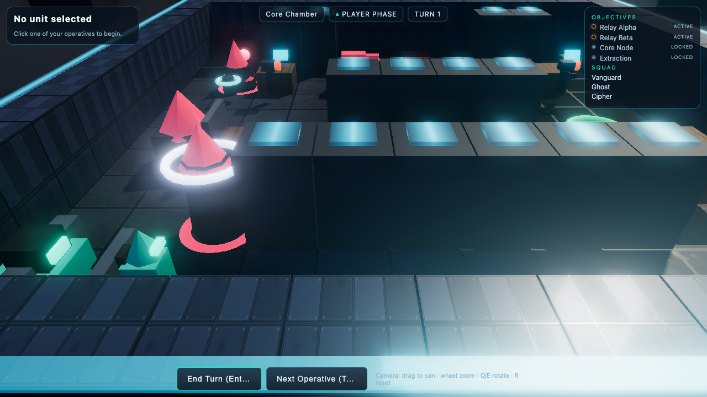
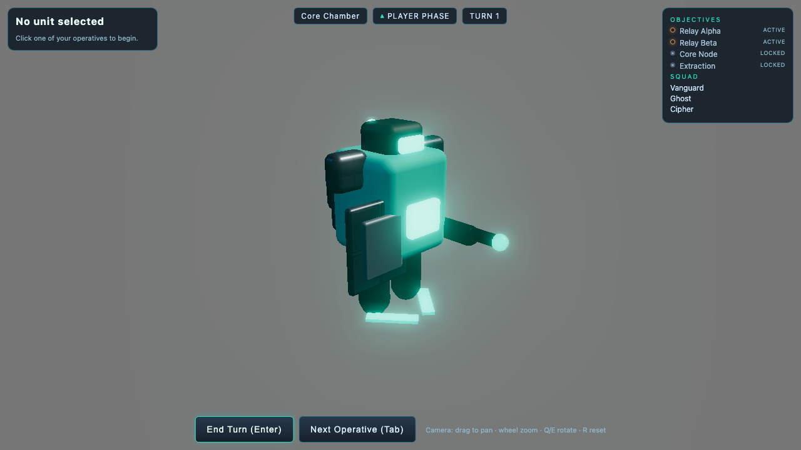
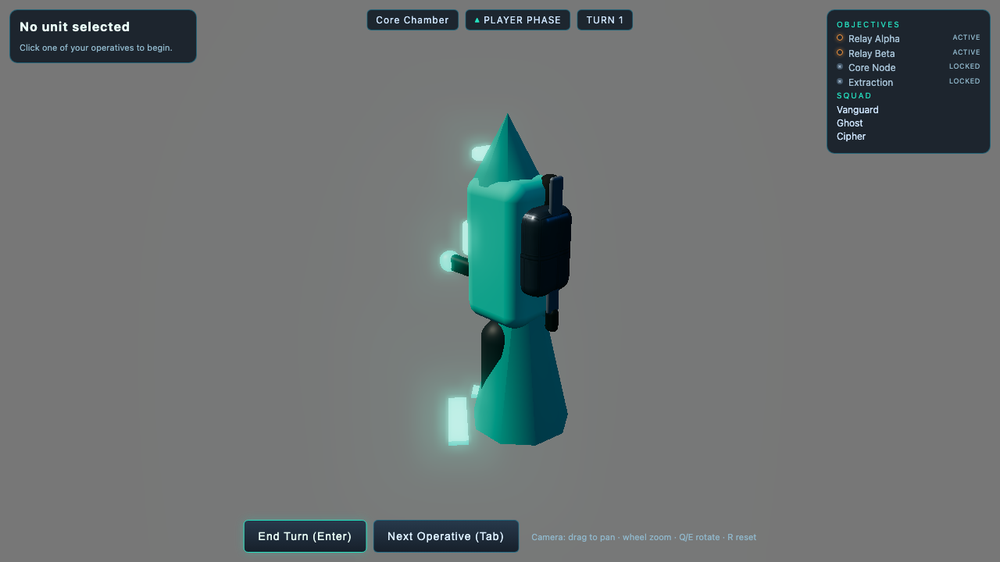
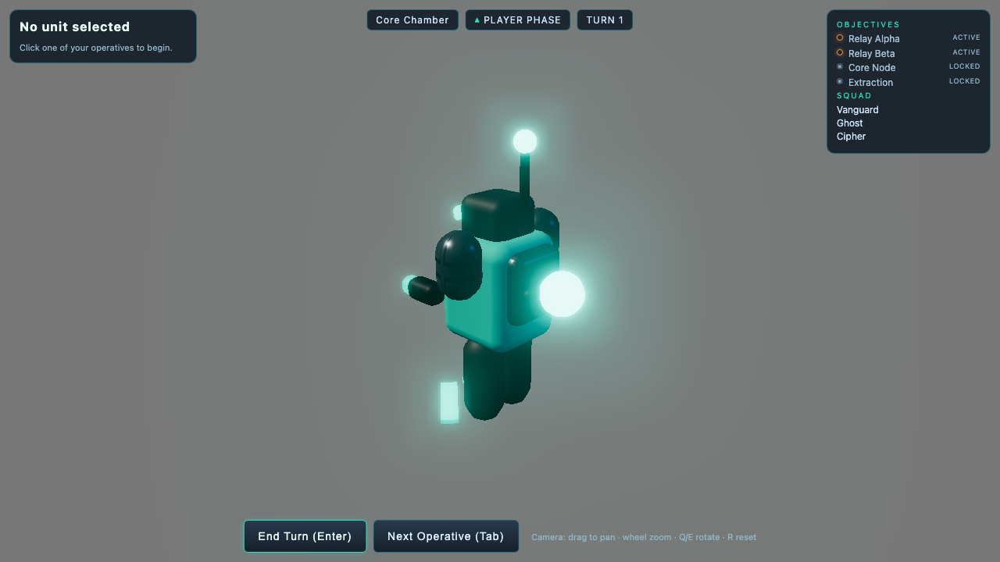

# Signal Breach

**A 3D isometric turn-based tactical infiltration game for the browser** — deterministic simulation,
no dice, and a leaderboard that only accepts submissions the server can replay and verify itself.



Three operatives infiltrate a security facility across a grid of tiles. You move, breach, hack and
extract under fog of war, enemy detection cones and an escalating alarm — and because the simulation
is fully deterministic, every recorded run can be re-executed and checked by the server before it is
allowed on the board.

---

## Screenshots

| Gameplay | Environment |
| --- | --- |
|  |  |

| Vanguard | Ghost | Cipher |
| --- | --- | --- |
|  |  |  |

Screenshots are captured straight from the browser test suite, not staged.

---

## What's in the game

- **Deterministic tactics** — seeded PRNG, A\* pathfinding, line-of-sight and cover, damage model,
  abilities and enemy AI scoring. The same action log always produces the same result.
- **Stealth and detection** — fog of war, enemy vision cones, alert states, and movement noise that
  can give you away.
- **A security network as a real subsystem** — cameras, turrets, cores and network nodes are powered
  devices with owners. Hijack them and they turn on the guards that relied on them.
- **Alarm escalation** — noise and gunfire raise the alert level; silenced actions keep the board
  covert.
- **Three missions with authored win conditions**, plus a replay viewer.
- **A leaderboard that verifies** — `/api/submit` re-runs the submitted action log against the *same*
  simulation package and rejects anything that does not reproduce the claimed outcome.
- **Saves with migration** — versioned save format with an explicit migration path.

## Controls

| Input | Action |
| --- | --- |
| Click an operative | Select it |
| Click an enemy | Shoot |
| Click the ground | Move |
| `Tab` | Next operative |
| `Enter` | End turn |
| Drag / wheel / `Q` `E` / `R` | Pan, zoom, rotate, reset camera |
| `Esc` | Cancel a pending action |

The HUD states the current objective, the room, the phase and the turn, and shows optional
challenges separately from required progress.

---

## Architecture

The separation is what makes the game testable headlessly — the simulation has no idea a renderer
exists.

- **`packages/sim` (`@sb/sim`)** — the authoritative simulation: PRNG, map, A\* pathfinding, LOS and
  cover, deterministic combat, abilities, enemy AI (scoring), turn system, replay, save, scoring and
  replay validation. No DOM, no Three.js. Runs in the browser, in Node, and under Vitest.
- **`packages/server` (`@sb/server`)** — Node HTTP server using the built-in `node:sqlite` (no native
  dependency): `/api/health`, `/api/submit`, `/api/leaderboard` and the verified match archive. It
  replays the submitted action log with the **same** `@sb/sim` package, and only stores runs it can
  reproduce.
- **`packages/web` (`@sb/web`)** — Vite + React + Three.js: camera rig, lighting, shadows, fog,
  bloom, ambient occlusion, procedurally generated unit and tile geometry, effects, HUD, menus,
  briefing, replay viewer and audio.

### Determinism invariants

- Rules code never calls `Math.random()` — all randomness comes from the seeded PRNG.
- The renderer never feeds back into the rules.
- The server and the browser share one simulation package.
- Replays re-run the action log; they are not recordings.

`scripts/verify-all.sh` is the single verification entry point: typecheck, production build, unit and
integration tests, then the full browser suite.

---

## Run it

```sh
npm install

npm run verify      # typecheck + build + unit/integration + browser journeys
npm test            # unit + integration (Vitest)
npm run e2e         # browser journeys (Playwright)
npm run typecheck   # tsc --noEmit
npm run build       # production web build

npm run serve       # leaderboard/archive server on :8787  (SB_PORT to change)
SB_DB=./data/lb.sqlite npm run serve   # persist the leaderboard

npm run dev -w @sb/web                 # dev server for the game
```

The browser suite launches its own server and Vite instance, so `npm run e2e` is self-contained.

## Tech

TypeScript · Three.js · React · Vite · Node (`node:sqlite`) · Vitest · Playwright.

## Testing

- **Unit and integration** — Vitest suites for the simulation and the server, including determinism,
  replay validation, save migration, security-network behaviour and archive integrity.
- **Browser journeys** — Playwright specs covering the title and deploy flow, fog of war, detection,
  the security network, missions, the leaderboard round trip, replay, tamper rejection, UI behaviour
  and the visual criteria for characters and environment.

Several of the browser specs assert against **independent oracles** rather than the display: for
example the detection spec recomputes the expected telegraph set from authoritative unit state and
fails on both a missing *and* an invented cone, and the security spec is a two-run contrast that
changes only a device's authority.

## License

No license has been chosen for this repository yet, so it is **all rights reserved** by default. Open
an issue if you would like a specific license applied.
